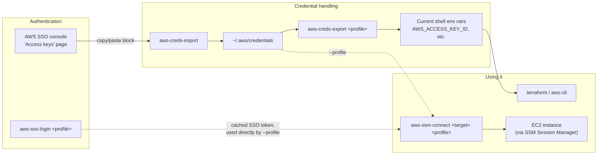

# aws-utils

AWS credential and access helper shell functions for PDS engineers: import pasted SSO console credentials, export a profile's credentials into your current shell, SSO login, and connect to an EC2 instance over SSM — with consistent `aws-*` naming instead of scattered one-off scripts.

## Prerequisites

- [AWS CLI v2](https://docs.aws.amazon.com/cli/latest/userguide/getting-started-install.html), configured with your SSO profiles
- `bash` or `zsh`
- macOS `pbpaste` (only needed for `aws-creds-import`'s clipboard fallback; piping via stdin works anywhere)

## Install

Clone this repo, then source the shell functions from your `.bashrc` / `.zshrc`:

```bash
git clone https://github.com/NASA-PDS/aws-utils.git ~/proj/aws-utils
echo 'source ~/proj/aws-utils/shell/aws-utils.sh' >> ~/.bashrc
source ~/.bashrc
```

## Commands

| Command | Usage | What it does |
|---|---|---|
| `aws-creds-import` | `pbpaste \| aws-creds-import` or `aws-creds-import < creds.txt` | Parses a pasted/piped AWS console credentials block and writes/replaces that profile's block in `~/.aws/credentials` |
| `aws-creds-export` | `aws-creds-export <profile>` | Evaluates `aws configure export-credentials` for the profile into your **current shell's** environment, so subsequent commands (terraform, aws-cli, …) don't need `--profile` |
| `aws-sso-login` | `aws-sso-login <profile>` | Runs `aws sso login --profile <profile>` |
| `aws-ssm-connect` | `aws-ssm-connect <target> <profile>` | Runs `aws ssm start-session --target <target> --profile <profile>` to shell into an EC2 instance without opening inbound SSH |

`aws-creds-export` is the one command that *must* be a sourced shell function rather than a standalone script: it needs to mutate your current shell's environment via `eval`, which only the shell itself can do — a subprocess can never reach back into its parent's environment. All four commands are kept together in `shell/aws-utils.sh` for that reason, so there's a single line to add to your rc file.

## Workflow



## Development

```bash
pre-commit install
pre-commit install -t pre-push
pre-commit install -t prepare-commit-msg
pre-commit install -t commit-msg
```

Lint the shell functions:

```bash
shellcheck shell/aws-utils.sh
```

### Secrets detection

```bash
scripts/detect_secrets_baseline.sh scan   # regenerate .secrets.baseline
scripts/detect_secrets_baseline.sh audit  # interactively review/classify detected secrets
```

To exclude additional files specific to this repo from scanning, add regex patterns (one per line) to `.detect-secrets-ignore`.

## Code of Conduct

All users and developers of the NASA-PDS software are expected to abide by our [Code of Conduct](https://github.com/NASA-PDS/.github/blob/main/CODE_OF_CONDUCT.md).

## Contributing

For information on how to contribute to NASA-PDS codebases please take a look at our [Contributing guidelines](https://github.com/NASA-PDS/.github/blob/main/CONTRIBUTING.md).
