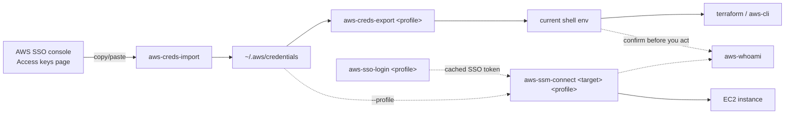

# aws-utils — Overview

A sprint-review-friendly summary of what this repo is and why it exists. For install instructions and the full command reference, see the [README](../README.md).

## Why

The credential-import script and the shell function that exports temp credentials into the current session lived in two unrelated places, with two unrelated naming schemes — and neither had an SSO-login, identity-check, or SSM-connect counterpart, so those stayed as commands typed from memory.

| Before | After |
|---|---|
| `cloud-tools/scripts/aws-creds` — untracked, unreleased, buried in a Python package repo | One repo: `NASA-PDS/aws-utils` |
| `awscreds-ex()` — one more function in a 260-line `.bashrc` | One line in `.bashrc`: `source aws-utils.sh` |
| SSO login / SSM connect / "which account am I?" — typed out by hand each time | Five commands, one naming scheme: `aws-*` |
| No shared naming convention, nothing to hand a teammate | shellcheck + detect-secrets on every push |

## What

All five commands are shell functions rather than standalone scripts, because `aws-creds-export` has to `eval` into the caller's own shell to set environment variables — a subprocess can never reach back into its parent's environment, so the other four ride along in the same sourced file for one clean install step.

| Command | What it does |
|---|---|
| `aws-creds-import` | Paste or pipe a console credentials block — writes/replaces that profile's block in `~/.aws/credentials`. |
| `aws-creds-export <profile>` | Evaluates the profile's resolved credentials into the current shell. **The one command that must stay a sourced function.** |
| `aws-sso-login <profile>` | `aws sso login --profile <profile>`, with usage help on a bad call. |
| `aws-whoami [profile]` | `aws sts get-caller-identity`, optionally scoped to a profile — confirms which account/identity you're about to act as before doing something destructive. |
| `aws-ssm-connect <target> <profile>` | Shells into an EC2 instance via SSM Session Manager — no inbound SSH port needed. |

## Workflow

Two independent paths into AWS — long-lived console creds, or SSO — that both end up usable by terraform, the CLI, or an SSM session. `aws-whoami` isn't part of either path; run it any time you want to confirm which identity is currently active.



## Try it

```bash
# once
git clone https://github.com/NASA-PDS/aws-utils.git ~/proj/aws-utils
echo 'source ~/proj/aws-utils/shell/aws-utils.sh' >> ~/.bashrc

# day to day
aws-sso-login dev-power
aws-whoami dev-power
aws-creds-export dev-power
aws-ssm-connect i-07eb3e63987337a8a dev-power
```
